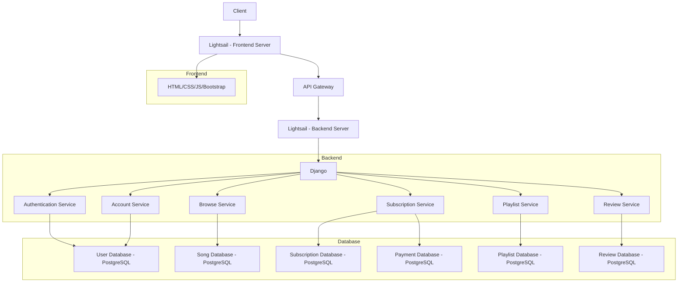
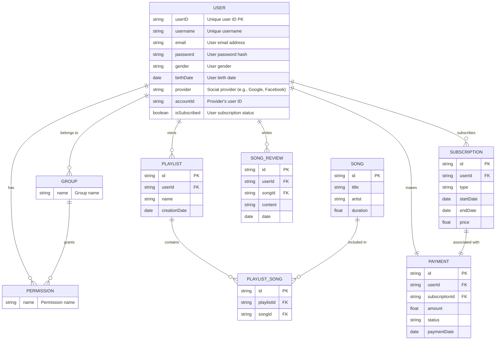

# 멜로디마켓

## 목표와 기능
1. 목표와 기능
   1. 목표
   2. 기능
   3. 팀구성 - 실제 사진 업로드 
## 개발 환경 및 배포 URL
   1. 기술스택
   2. 개발 환경 (+협업도구)
   3. 배포 URL
   4. URL 구조 (마이크로식)
## 프로젝트 구조
   1. 파일구조    
   2. 브랜치전략
## 아키텍쳐

## 기능 명세 
## 플로우 다이어그램

## ERD 다이어그램

## WBS
## 기능명세서
## 와이어프레임
## 역할분담
## 트러블 슈팅
## 개발하며 느낀점 
