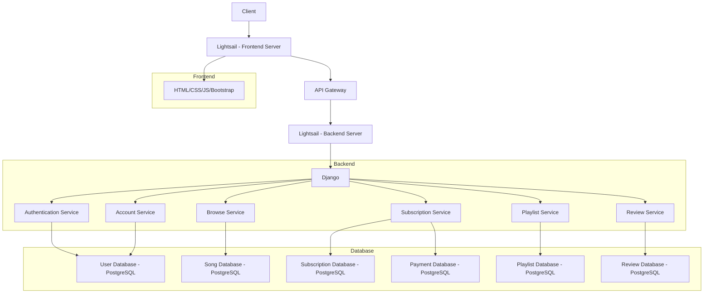
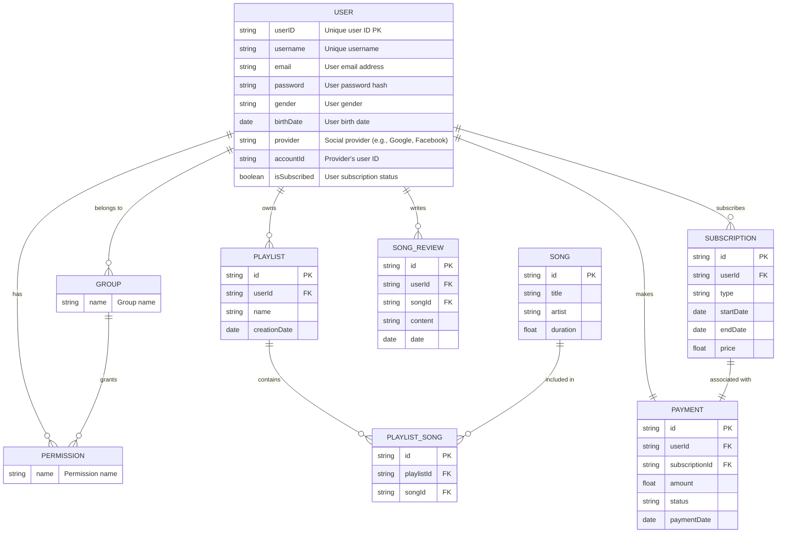

# 멜로디마켓

## 목표와 기능
### 목표 ###
Melody market은 구독 기반의 음악 스트리밍 사이트로, 사용자 중심의 음악 스트리밍 서비스를 제공합니다. 계정 관리, 음악 검색 및 추천, 플레이리스트 관리 및 앨범에 대한 리뷰 작성 기능을 제공하여 사용자들이 개인화된 음악 스트리밍 경험을 제공하는 것을 목표로 합니다.

### 기능 ###
- 사용자 계정 관리: 이메일과 소셜 계정을 통한 회원가입 및 로그인, 비밀번호 재설정, 사용자 권한 관리.
- 검색 및 추천 기능: 키워드 및 장르 기반 음악 추천, 유사도 검색, 오타 교정, 최근 검색어 저장.
- 구독 & 결제 관리: 구독 옵션 조회 및 선택, 신용카드를 이용한 결제 처리, 구독 정보 조회 및 취소.
- 플레이리스트 관리: 플레이리스트 생성, 조회, 수정, 삭제 및 플레이리스트 내 노래 추가/제거.
- 리뷰 및 평점 관리: 리뷰 작성, 조회, 수정, 삭제 및 평점 추가.

### 팀구성 및 역할분담 ###
FE, BE는 각자 맡은 부분을, CI/CD는 단계별로 나눠서 하기로 하였고, 장고 APP별 담당자는 아래와 같습니다.
- 유지은 : Account
- 유진선 : Subscription
- 신찬수 : Browse
- 신선하 : Playlist
- 장민지 : Review

## 개발 환경 및 배포 URL
### 기술스택 ###
### 개발 환경 (+협업도구) ###
### 배포 URL ###
### URL 구조 (마이크로식) ###
## 프로젝트 구조
   1. 파일구조    
   2. 브랜치전략
## 아키텍쳐

## 기능 명세 
## 플로우 다이어그램

## ERD 다이어그램

## WBS
## 와이어프레임
## 역할분담
## 트러블 슈팅
## 개발하며 느낀점 
선하 : 개발자는 단순히 코드 한 줄 한 줄을 작성하는 것이 아니라, 프로젝트 전체를 파악하고, 각 부분이 어떻게 조화롭게 작동하는지 이해하는 것이 중요하다는 것을 깨달았습니다. 또한, 각 부분을 개별적으로 다루면서도 전체적인 목표를 고려해야 한다는 균형을 유지해야 한다고 생각했습니다. 협업 툴을 사용하여 업무를 시각화하고 계획을 세우는 것이 도움이 되었습니다.
