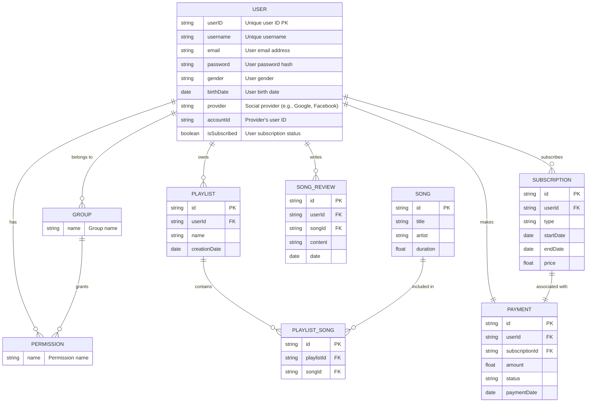
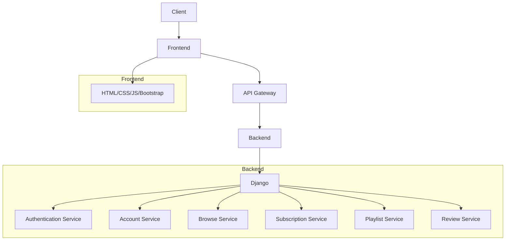

# 멜로디마켓

## 목표와 기능
### 목표 ###
Melody market은 구독 기반의 음악 스트리밍 사이트로, 사용자 중심의 음악 스트리밍 서비스를 제공합니다. 계정 관리, 음악 검색 및 추천, 플레이리스트 관리 및 앨범에 대한 리뷰 작성 기능을 제공하여 사용자들이 개인화된 음악 스트리밍 경험을 제공하는 것을 목표로 합니다.

### 기능
- **회원가입과 로그인/로그아웃**: 사용자는 이메일과 비밀번호를 통해 계정을 생성하고, 로그인 및 로그아웃을 할 수 있습니다.
- **구독 관리**: 사용자는 음악 구독 옵션을 선택하고, 필요에 따라 구독을 취소하거나 정보를 조회할 수 있습니다.
- **결제 처리**: 신용카드 정보를 통한 결제가 가능하며, 결제 정보 입력 후 결제 완료 기능을 지원합니다.
- **플레이리스트 관리**: 사용자는 자신의 플레이리스트를 자유롭게 생성, 수정, 삭제할 수 있습니다.
- **리뷰 관리**: 사용자는 리뷰를 작성, 조회하며 필요에 따라 수정하거나 삭제할 수 있습니다.

## 레포지토리
BE : [https://github.com/melodyteam-org/melodymarket-django](https://github.com/melodyteam-org/melodymarket-django) 
FE : [https://github.com/melodyteam-org/melodymarket-fe](https://github.com/melodyteam-org/melodymarket-fe)

## 사용기술
**Front-end** 

**Back-end** 

**Project management** 

## 기능 명세 

 
  
### 사용자 계정 관리 (Account)

- **회원가입:** 사용자는 이메일, 사용자 이름, 비밀번호를 입력하여 계정을 생성 할 수 있습니다.  
- **로그인:** 사용자는 이메일과 비밀번호를 사용하여 로그인할 수 있습니다.   
- **로그아웃:** 사용자는 로그인한 상태에서 로그아웃이 가능합니다.  
   
  [사용자 계정 관리 소스 코드 링크](https://github.com/melodyteam-org/melodymarket-django/tree/dev/account)

### 구독 & 결제 관리 (Subscription)

- **구독 선택 및 관리**: 사용자는 구독의 시작 및 종료 날짜, 가격 등의 정보를 확인할 수 있습니다.
- **구독 정보 조회**: 사용자의 현재 구독 상태와 결제 이력 정보를 조회합니다.
- **구독 취소**: 사용자가 현재 진행 중인 구독을 취소합니다.
- **결제 정보 입력 (신용카드)**: 결제 화면에서 사용자가 입력한 신용카드 정보를 받습니다.
    
  [구독 & 결제 관리 소스 코드 링크](https://github.com/melodyteam-org/melodymarket-django/tree/dev/subscription)

### 검색 & 추천 기능 (Browse)

- **검색 결과 반환 :** 사용자가 검색한 결과를 반환합니다.
  
  [검색 & 추천 기능 소스코드 링크](https://github.com/melodyteam-org/melodymarket-django/tree/feature-recommendation-%231-top10%EC%B6%94%EC%B2%9C/util)

### 플레이리스트 관리 (Playlist)

- **플레이리스트 생성:** 사용자는 자신의 플레이리스트를 생성할 수 있습니다.
- **플레이리스트 수정:** 사용자는 자신의 플레이리스트를 수정할 수 있습니다.
- **플레이리스트 삭제:** 사용자는 플레이리스트에 트랙을 삭제할 수 있습니다.
- **플레이리스트 보기:** 사용자는 자신의 플레이리스트를 볼 수 있습니다.
  
  [플레이리스트 관리 소스코드 링크](https://github.com/melodyteam-org/melodymarket-django/tree/dev/playlist)

### **리뷰 & 평점 관리 (Review)**

- **리뷰 보기:** 모든 사용자는 노래에 대해 리뷰를 볼 수 있습니다.
- **리뷰 작성:** 인증된(로그인) 사용자는 노래에 대해 리뷰를 작성할 수 있습니다.
- **리뷰 수정:** 사용자는 본인이 작성한 리뷰를 수정할 수 있습니다.
- **리뷰 삭제:** 사용자는 본인이 작성한 리뷰를 삭제할 수 있습니다.

    
  [리뷰 & 평점 관리 소스코드 링크](https://github.com/melodyteam-org/melodymarket-django/tree/dev/review)

## 담당자 및 기능개발 진행상황

| 팀원   | 담당 APP      | 기능 설명                                     | 개발 완료    | 개발 중     |
|--------|---------------|----------------------------------------------|------------|------------|
| 유지은 | Account       | 회원가입                                     | ✔️          |            |
|        |               | 로그인/로그아웃                              | ✔️          |            |
|        |               | 사용자 모델 커스터마이징                      |            | 🔧          |
|        |               | 사용자 권한 및 그룹 관리                      |            | 🔧          |
| 유진선 | Subscription  | 구독 선택 및 관리                            | ✔️          |            |
|        |               | 결제 정보 입력 (신용카드)                     | ✔️          |            |
|        |               | 구독 정보 조회                               |   ✔️         |         |
|        |               | 구독 취소                                    |      ✔️      |          |
|        |               | 결제 완료                                    |            |   🔧       |
| 신찬수 | Browse        | 검색 결과 반환                               |            | 🔧          |
|        |               | 최근 검색어                                  |            | 🔧          |
|        |               | 유사도 검색기                                |            | 🔧          |
|        |               | 오타 교정                                   |            | 🔧          |
|        |               | 검색/장르 기반 음악 추천                          |            | 🔧          |
| 신선하 | Playlist      | 플레이리스트 CRUD 기능                                  | ✔️          |            |
|        |               | 플레이리스트 내 노래 추가/삭제                  |            | 🔧          |
| 장민지 | Review        | 리뷰 CRUD                                    |     ✔️       | 🔧          |
|        |               | 평점 추가                                    |            | 🔧          |
|        |               | 평균 평점 계산                               |            | 🔧          |

## ERD 다이어그램

### URL 구조 (마이크로식) ###

* **Main**

| App              | URL                   |  HTML File Name    | 설명                                             |
|------------------|-----------------------|--------------------|--------------------------------------------------|
| main             | /                     | main.html          | 홈화면                                            |
| main             | /about                | main/about.html    | 소개 화면                                         |

  
* **Account**

| app              | URL                          | HTML File Name               | 설명                          |
|------------------|------------------------------|------------------------------|-------------------------------|
| account          | 'account/register/'          |  account/register.html       | 회원가입                      |
| account          | 'account/login/'             |  account/login.html          | 로그인                        |
| account          | 'account/logout/'            |  account/logout.html         | 로그아웃                      |
| account          | 'account/password_reset/'    |  account/pwrest.html         | 비밀번호 재설정                |
  
* **Subscription**

| app          | URL                          |  HTML File Name                     | 설명                          |
|--------------|------------------------------|-------------------------------------|-------------------------------|
| subscription | 'subscription/'              |  subscription/subscription.html     | 이용권 목록                    |
| subscription | 'subscription/payment'       |  subscription/payment.html          | 이용권 결제                    |  
  
* **Browse**

| app              | URL                                          |   HTML File Name                     | 설명                                             |
|------------------|----------------------------------------------|--------------------------------------|--------------------------------------------------|
| browse           | 'browse/search/'                             |  browse/search.html                  | 트랙 또는 앨범을 검색                              |
| browse           | 'browse/{keyword_id}/recommendation/'        |  browse/kw_recommendation.html       | 검색을 통해 top 10 곡을 추천                       |
| browse           | 'browse/{genre_id}/recommendation/'          |  browse/genre_recommendation.html    | 장르를 선택하여  top 10 곡을 추천                  |
  
* **Playlist**

| app           | URL                                            |   HTML File Name                     | 설명                                             |
|---------------|------------------------------------------------|--------------------------------------|--------------------------------------------------|
| playlist      | 'playlist'                                     |  playlist/list.html                  | 플레이리스트 목록                                 |
| playlist      | 'playlist/create'                              |  playlist/list_create.html           | 플레이리스트 생성                                 |
| playlist      | 'playlist/{playlistId}/edit'                   |  playlist/list_edit.html             | 플레이리스트 수정                                 |
| playlist      | 'playlist/{playlistId}/delete'                 |  playlist/list_delete.html           | 플레이리스트를 삭제                               |
| playlist      | 'playlist/{playlistId}'                        |  playlist/list_view.html             | 플레이리스트 내의 트랙 목록 보기                   |
| playlist      | 'playlist/{playlistId}/{trackId}/add'          |  playlist/track_add.html             | 플레이리스트에 트랙 추가                           |
| playlist      | 'playlist/{playlistId}/{trackId}/delete'       |  playlist/track_delete.html          | 플레이리스트에서 트랙 삭제                         |
  
* **Review**

| app         | URL                              |  HTML File Name                                | 설명                                                                                       |
|-------------|----------------------------------|--------------------------------------------|------------------------------------------------|
| review      | 'review/{album_id}'              |   review/write.html                        | 리뷰를 작성    |
| review      | 'review/{album_id}/rating/'      |   review/rating.html                       | 평점을 계산    |
| review      | 'reviews/{review_id}/comment/'   |   review/comment.html                      | 리뷰에 대한 댓글 작성      |
  

## 아키텍쳐

## 프로젝트 구조
   
   📁 MELODYMARKET-DJANGO/  
├── 📁 account/  
│ ├── 📁 migrations/  
│ ├── 📁 templates/  
│ │ └── 📁 accounts/  
│ │ └── 📄 base.html  
│ ├── 📄 init.py  
│ ├── 📄 admin.py  
│ ├── 📄 apps.py  
│ ├── 📄 forms.py  
│ ├── 📄 managers.py  
│ ├── 📄 models.py  
│ ├── 📄 tests.py  
│ ├── 📄 urls.py  
│ └── 📄 views.py  
├── 📁 config/  
│ ├── 📁 settings/  
│ │ ├── 📄 init.py  
│ │ ├── 📄 base.py  
│ │ ├── 📄 local.py  
│ │ └── 📄 production.py  
│ └── 📄 init.py  
├── 📁 static/  
│ ├── 📄 asgi.py  
│ ├── 📄 db.sqlite3  
│ ├── 📄 urls.py  
│ └── 📄 wsgi.py  
├── 📁 playlist/  
│ ├── 📁 migrations/  
│ ├── 📁 templates/  
│ │ └── 📁 playlist/  
│ ├── 📄 init.py  
│ ├── 📄 admin.py  
│ ├── 📄 apps.py  
│ ├── 📄 forms.py  
│ ├── 📄 models.py  
│ ├── 📄 serializers.py  
│ ├── 📄 tests.py  
│ ├── 📄 urls.py  
│ └── 📄 views.py  
├── 📁 review/  
│ ├── 📁 migrations/  
│ ├── 📄 init.py  
│ ├── 📄 admin.py  
│ ├── 📄 apps.py  
│ ├── 📄 models.py  
│ ├── 📄 tests.py  
│ ├── 📄 urls.py  
│ └── 📄 views.py  
├── 📁 subscription/  
│ ├── 📁 migrations/  
│ ├── 📄 init.py  
│ ├── 📄 admin.py  
│ ├── 📄 apps.py  
│ ├── 📄 models.py  
│ ├── 📄 serializers.py  
│ ├── 📄 tests.py  
│ ├── 📄 urls.py  
│ └── 📄 views.py  
├── 📄 .gitignore  
├── 📄 manage.py  
├── 📄 pytest.ini  
├── 📄 README.md  
└── 📄 requirements.txt  
 
  
## 플로우 다이어그램

## WBS
## 와이어프레임
## 트러블 슈팅
* User 모델 커스터마이징 세팅 
  AbstractBaseUser를 상속받아 user 모델을 커스터마이징 하는 과정에서, admin.py와 settings폴더의 base.py에 코드를 추가하지 않아, view 코드에서 오류가 있었습니다. user모델 커스터마이징에 대한, 복습을 통해 디버깅에 성공할 수 있었습니다.

## 협업 - 깃허브 칸반 및 이슈 활용
칸반 링크 : https://github.com/orgs/melodyteam-org/projects/1/views/1  
이슈 링크 : https://github.com/melodyteam-org/melodymarket-django/issues

## 개발하며 느낀점 
**선하**:
개발자는 단순히 코드 한 줄 한 줄을 작성하는 것이 아니라, 프로젝트 전체를 파악하고, 각 부분이 어떻게 조화롭게 작동하는지 이해하는 것이 중요하다는 것을 깨달았습니다. 또한, 각 부분을 개별적으로 다루면서도 전체적인 목표를 고려해야 한다는 균형을 유지해야 한다고 생각했습니다. 협업 툴을 사용하여 업무를 시각화하고 계획을 세우는 것이 도움이 되었습니다.

**진선**:

- 깃헙에서 협업 툴 : organization을 만들어, issues를 통해 브랜치를 만드는 과정을 통해, 유용한 협업 툴을 알 수 있었고, 브랜치 전략에 대해 이해할 수 있었습니다.
- DRF의 viewset의 확장성 : DRF로 프로젝트를 구현해보면서, DRF의 여러 view들을 시도해보았는데, 그 중 viewset의 편리함과 확장성에 대해 이해할 수 있었습니다.

**민지**:
이 프로젝트를 통해 얻은 귀중한 교훈들은 다음과 같습니다

- 협업의 가치: 다양한 배경을 가진 팀원들과 협력하며 서로 다른 아이디어와 접근 방식에서 배울 수 있었습니다. 이는 프로젝트를 더욱 풍부하게 만들었습니다.
- 전체적인 관점 유지: 개별적인 기능과 코드에 집중하는 것도 중요하지만, 프로젝트의 전체 목표와 어떻게 모든 부분이 조화롭게 작동하는지 이해하는 것이 더 중요합니다. 협업 도구를 사용하여 업무를 시각화하고 계획하는 것이 큰 도움이 되었습니다.
- 결론적으로 개발자로서 단순히 코드를 작성하는 것을 넘어서, 프로젝트의 큰 그림을 보고 각 부분이 어떻게 상호작용하는지 파악하는 능력이 매우 중요함을 깨달았습니다. 이 프로젝트는 그런 점에서 매우 교육적이었으며, 팀원 모두에게 값진 경험이 되었습니다.

**지은**:  
처음으로 하는 팀 프로젝트이고 아직 협업을 하기에는 실력이 부족하다고 생각했기에 많은 걱정이 되었으나 다행이 팀장님이 잘 이끌어주셔서 크게 방황하지 않고 프로젝트를 할 수 있었습니다. 처음에는 GitHub의 기능도 제대로 알지 못했었는데, 이번 프로젝트를 통해 GitHub 기능에 더욱 친숙해졌고, 협업을 할때에는 칸반보드, 티켓, 브랜치 등 다양한 기능을 사용하여 한다는 것을 알게 되었습니다. 뿐만 아니라 이슈를 만들고 브랜치를 만들어서 관리하고 사용하는 방법을 알게 되었고 이러한 기능이 있다는 것을 알게 되어서 좀 더 과감하게 코드를 짜보는 계기가 되었습니다. 팀원들과 소통하면서 서로 조율하는 과정을 배우게 되었고 스스로 좀 더 적극적으로 참여를 했으면 더 좋은 결과물을 만들지 않았을까 하는 아쉬움도 남았습니다. 이번 팀  프로젝트를 통해서 Django에 대한 이해뿐만 아니라 협업을 효과적으로 하는 방법을 알게 되었고 개발자로 더욱 성장하는 시간이 되었습니다.
