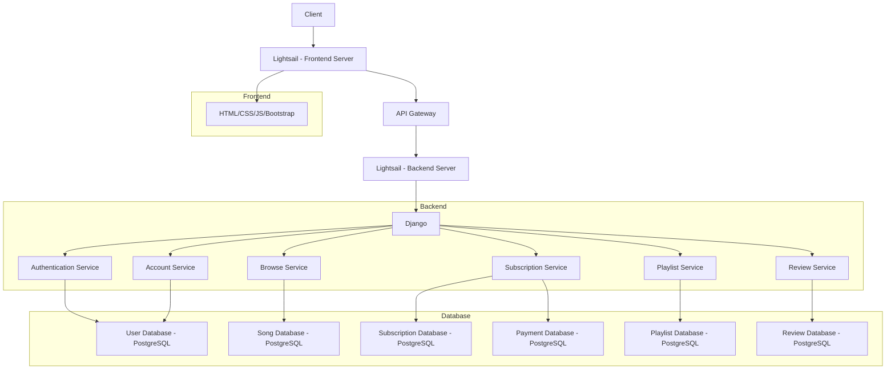
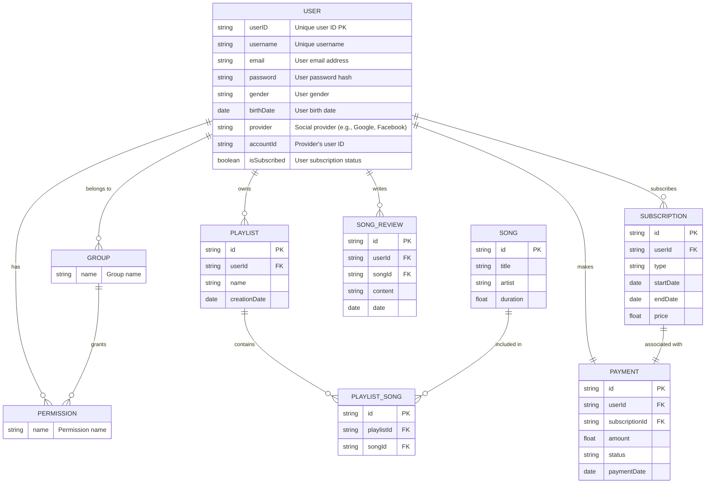

# 멜로디마켓

## 목표와 기능
### 목표 ###
Melody market은 구독 기반의 음악 스트리밍 사이트로, 사용자 중심의 음악 스트리밍 서비스를 제공합니다. 계정 관리, 음악 검색 및 추천, 플레이리스트 관리 및 앨범에 대한 리뷰 작성 기능을 제공하여 사용자들이 개인화된 음악 스트리밍 경험을 제공하는 것을 목표로 합니다.

### 기능 ###
- 사용자 계정 관리: 이메일과 소셜 계정을 통한 회원가입 및 로그인, 비밀번호 재설정, 사용자 권한 관리.
- 검색 및 추천 기능: 키워드 및 장르 기반 음악 추천, 유사도 검색, 오타 교정, 최근 검색어 저장.
- 구독 & 결제 관리: 구독 옵션 조회 및 선택, 신용카드를 이용한 결제 처리, 구독 정보 조회 및 취소.
- 플레이리스트 관리: 플레이리스트 생성, 조회, 수정, 삭제 및 플레이리스트 내 노래 추가/제거.
- 리뷰 및 평점 관리: 리뷰 작성, 조회, 수정, 삭제 및 평점 추가.

### 팀구성 및 역할분담 ###
FE, BE는 각자 맡은 부분을, CI/CD는 단계별로 나눠서 하기로 하였고, 장고 APP별 담당자는 아래와 같습니다.
- 유지은 : Account
- 유진선 : Subscription
- 신찬수 : Browse
- 신선하 : Playlist
- 장민지 : Review

## 개발 기술 및 배포 URL
### 개발기술 ###
**Front-end** 

**Back-end** 

**Infra structure (예정)** 

**Project management** 

### 배포 URL ###
업데이트 예정

### URL 구조 (마이크로식) ###
**Browse**

| 구분             | URL                               | 설명                                                                                                 |
|------------------|-----------------------------------|------------------------------------------------------------------------------------------------------|
| 트랙 및 앨범 검색 | `/browse/search/`                 | 메인 화면에서 트랙 또는 앨범을 검색할 수 있는 페이지                                                   |
| 검색 추천        | `/browse/{keyword_id}/recommendation/` | 트랙 또는 앨범 관련 키워드를 검색하여, 그에 맞는 top 10 곡을 추천하는 페이지로 이동합니다. 검색 추천 페이지에서는 앨범 커버, 트랙 이름, 트랙 재생 버튼, 트랙 추가 버튼을 제공합니다. |
| 장르 추천        | `/browse/{genre_id}/recommendation/`   | 메인 화면에서 제공된 장르를 선택하여, 그에 맞는 top 10 곡을 추천하는 페이지로 이동합니다. 장르 추천 페이지에서는 앨범 커버, 트랙 이름, 트랙 재생 버튼, 트랙 추가 버튼을 제공합니다. |

**Account**

| 구분             | URL                               | 설명                                                                                                 |
|------------------|-----------------------------------|------------------------------------------------------------------------------------------------------|
| 이메일 가입      | `/accounts/register/`             | 이메일, 사용자 이름, 비밀번호를 입력하여 계정을 생성할 수 있는 페이지                                   |
| 로그인           | `/accounts/login/`                | 이메일과 비밀번호를 사용하여 로그인할 수 있는 페이지                                                   |
| 로그아웃         | `/accounts/logout/`               | 로그인한 사용자가 로그아웃할 수 있는 기능                                                               |
| 비밀번호 재설정 | `/accounts/password_reset/`       | 사용자는 이메일을 통해 비밀번호를 재설정 할 수 있는 페이지                                             |

**Subscription**

| 구분         | URL                      | 설명                                                             |
|--------------|--------------------------|------------------------------------------------------------------|
| 이용권 목록 | `/subscription/`         | 회원만이 구매가능한 이용권 목록을 볼 수 있는 페이지             |
| 결제         | `/subscription/payment`  | 이용권을 구매할 수 있는 결제 페이지                             |

**Playlist**

| 구분     | URL                             | 설명                                                                 |
|----------|---------------------------------|----------------------------------------------------------------------|
| 보기     | `/playlists`                    | 로그인한 유저가 자신의 플레이리스트 목록을 볼 수 있습니다.           |
| 생성     | `/playlists/create`             | 새로운 플레이리스트를 만들 수 있는 페이지로 이동합니다.              |
| 수정     | `/playlists/{playlistId}/edit`  | 플레이리스트의 이름을 수정할 수 있는 페이지로 이동합니다.            |
| 삭제     | `/playlists/{playlistId}/delete`| 특정 플레이리스트를 삭제하며, 해당 플레이리스트의 모든 트랙도 삭제됩니다. |
| 트랙 보기| `/playlists/{playlistId}`      | 특정 플레이리스트 내의 트랙 목록을 볼 수 있습니다.                 |
| 트랙 추가| `/playlists/{playlistId}/{trackId}/add` | 플레이리스트에 트랙을 추가할 수 있는 기능입니다.               |
| 트랙 삭제| `/playlists/{playlistId}/{trackId}/delete` | 특정 플레이리스트에서 트랙을 삭제할 수 있습니다.           |

**Review**

| 구분                    | URL                              | 설명                                                                                       |
|-------------------------|----------------------------------|--------------------------------------------------------------------------------------------|
| 리뷰 작성  | `/review/{album_id}`             | 특정 앨범에 대한 리뷰를 작성할 수 있는 페이지                                                |
| 평점 계산  | `/review/{album_id}/ratings/`    | 특정 앨범에 대한 평점을 생성합니다.                                                          |
| 댓글 작성  | `/reviews/{review_id}/comments/`| 특정 리뷰에 대한 댓글을 작성할 수 있는 페이지입니다. (회원만 가능)                           |

## 프로젝트 구조
   
   📁 MELODYMARKET-DJANGO/  
├── 📁 account/  
│ ├── 📁 migrations/  
│ ├── 📁 templates/  
│ │ └── 📁 accounts/  
│ │ └── 📄 base.html  
│ ├── 📄 init.py  
│ ├── 📄 admin.py  
│ ├── 📄 apps.py  
│ ├── 📄 forms.py  
│ ├── 📄 managers.py  
│ ├── 📄 models.py  
│ ├── 📄 tests.py  
│ ├── 📄 urls.py  
│ └── 📄 views.py  
├── 📁 config/  
│ ├── 📁 settings/  
│ │ ├── 📄 init.py  
│ │ ├── 📄 base.py  
│ │ ├── 📄 local.py  
│ │ └── 📄 production.py  
│ └── 📄 init.py  
├── 📁 static/  
│ ├── 📄 asgi.py  
│ ├── 📄 db.sqlite3  
│ ├── 📄 urls.py  
│ └── 📄 wsgi.py  
├── 📁 playlist/  
│ ├── 📁 migrations/  
│ ├── 📁 templates/  
│ │ └── 📁 playlist/  
│ ├── 📄 init.py  
│ ├── 📄 admin.py  
│ ├── 📄 apps.py  
│ ├── 📄 forms.py  
│ ├── 📄 models.py  
│ ├── 📄 serializers.py  
│ ├── 📄 tests.py  
│ ├── 📄 urls.py  
│ └── 📄 views.py  
├── 📁 review/  
│ ├── 📁 migrations/  
│ ├── 📄 init.py  
│ ├── 📄 admin.py  
│ ├── 📄 apps.py  
│ ├── 📄 models.py  
│ ├── 📄 tests.py  
│ ├── 📄 urls.py  
│ └── 📄 views.py  
├── 📁 subscription/  
│ ├── 📁 migrations/  
│ ├── 📄 init.py  
│ ├── 📄 admin.py  
│ ├── 📄 apps.py  
│ ├── 📄 models.py  
│ ├── 📄 serializers.py  
│ ├── 📄 tests.py  
│ ├── 📄 urls.py  
│ └── 📄 views.py  
├── 📄 .gitignore  
├── 📄 manage.py  
├── 📄 pytest.ini  
├── 📄 README.md  
└── 📄 requirements.txt  

   

## 아키텍쳐

## 기능 명세 

  
  
### 사용자 계정 관리 (Account)

- **회원가입:** 사용자는 이메일, 사용자 이름, 비밀번호를 입력하여 계정을 생성 할 수 있습니다.
- **로그인/로그아웃:** 사용자는 이메일과 비밀번호를 사용하여 로그인할 수 있고, 로그인한 상태에서 로그아웃이 가능합니다.
- **사용자 모델 커스터마이징:** 사용자는 프로필에 추가정보(예: 성별, 생년월일)를 설정할 수 있습니다.
- **사용자 권한 및 그룹 관리:** 관리자는 사용자의 권한을 설정하고, 사용자를 다양한 그룹에 할당할 수 있습니다.
   
  [사용자 계정 관리 소스 코드 링크](https://github.com/melodyteam-org/melodymarket-django/tree/dev/account)

### 구독 & 결제 관리 (Subscription)

- **구독 선택 및 관리**: 사용자는 구독의 시작 및 종료 날짜, 가격 등의 정보를 확인할 수 있습니다.
- **구독 정보 조회**: 사용자의 현재 구독 상태와 결제 이력 정보를 조회합니다.
- **구독 취소**: 사용자가 현재 진행 중인 구독을 취소합니다.
- **결제 정보 입력 (신용카드)**: 결제 화면에서 사용자가 입력한 신용카드 정보를 받습니다.
- **결제 완료**: 사용자가 입력한 결제 정보를 바탕으로 결제 완료 버튼을 클릭하면 결제가 완료 됩니다.
    
  [구독 & 결제 관리 소스 코드 링크](https://github.com/melodyteam-org/melodymarket-django/tree/dev/subscription)

### 검색 & 추천 기능 (Browse)

- **검색 결과 반환 :** 사용자가 검색한 결과를 반환합니다.
- **최근 검색어:** 사용자의 최근 검색어 5개를 저장하고 검색 창 또는 별도의 섹션에 표시합니다.
- **유사도 검색기:** 사용자가 입력한 키워드와 유사한 음악을 검색하고 결과를 반환해줍니다.
- **오타 교정:** 검색어의 오타를 자동으로 감지하고 교정하여 정확한 검색 결과를 제공합니다.
- **검색 기반 음악 추천:** 사용자의 검색 키워드와 관련성이 높은 음악을 추천해줍니다.
- **장르 기반 음악 추천:** 사용자가 선택한 장르 내에서 인기 있는 음악을 추천해줍니다.
  
  [검색 & 추천 기능 소스코드 링크](https://github.com/melodyteam-org/melodymarket-django/tree/feature-recommendation-%231-top10%EC%B6%94%EC%B2%9C/util)

### 플레이리스트 관리 (Playlist)

- **CRUD 기능:** 사용자는 자신의 플레이리스트를 생성, 보기, 수정, 삭제할 수 있습니다.
- **플레이리스트 트랙 추가/삭제:** 사용자는 플레이리스트에 트랙을 추가하거나 삭제할 수 있습니다.
  
  [플레이리스트 관리 소스코드 링크](https://github.com/melodyteam-org/melodymarket-django/tree/dev/playlist)

### **리뷰 & 평점 관리 (Review)**

- **리뷰 보기:** 모든 사용자는 노래에 대해 리뷰를 볼 수 있습니다.
- **리뷰 작성:** 인증된(로그인) 사용자는 노래에 대해 리뷰를 작성할 수 있습니다.
- **리뷰 수정/삭제:** 사용자는 본인이 작성한 리뷰를 수정/삭제 할 수 있습니다.
- **평점 추가** : 사용자들은 노래에 대해 평점을 남길 수 있습니다.
- **평균 평점 계산:** 사용자들이 남긴 리뷰 점수를 기반으로 각 앨범의 평균 평점이 계산되어 앨범 상세 정보 페이지에 표시됩니다.
    
  [리뷰 & 평점 관리 소스코드 링크](https://github.com/melodyteam-org/melodymarket-django/tree/dev/review)
  
  
## 플로우 다이어그램

## ERD 다이어그램

## WBS
## 와이어프레임
## 역할분담
## 트러블 슈팅
## 개발하며 느낀점 
선하 : 개발자는 단순히 코드 한 줄 한 줄을 작성하는 것이 아니라, 프로젝트 전체를 파악하고, 각 부분이 어떻게 조화롭게 작동하는지 이해하는 것이 중요하다는 것을 깨달았습니다. 또한, 각 부분을 개별적으로 다루면서도 전체적인 목표를 고려해야 한다는 균형을 유지해야 한다고 생각했습니다. 협업 툴을 사용하여 업무를 시각화하고 계획을 세우는 것이 도움이 되었습니다.
